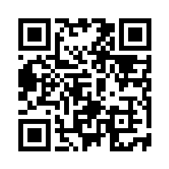

# MathDex

**MathDex** is a Pokémon-inspired, dungeon-crawling RPG for ages 9–11 where every
progression mechanic — attacking, catching, using items — is gated by solving an
arithmetic problem. Beat a wild Pokémon by getting the math right under a timer,
weaken-and-catch them with a Poké Ball, level up your party, and the puzzles scale
with your opponents. It's built as a mobile-web app (max 420 px wide) and is
installable as a PWA.

> 🤖 This project was **vibe-coded with Claude (Opus 4.8)** — design, gameplay logic,
> and UI were built collaboratively through conversation.

## Download to play

<p align="center">
  <a href="https://wodzuu.github.io/MathDex/"></a>
  <br/>
  <a href="https://wodzuu.github.io/MathDex/">https://wodzuu.github.io/MathDex/</a>
</p>

## Tech stack

React 18 · Vite 5 · TypeScript 5 · React Router 6 · Zustand 4 · Dexie 3 (IndexedDB) · vite-plugin-pwa

## Getting started

```bash
npm install
npm run dev        # start the dev server (http://localhost:5173)
npm run build      # type-check + production build → dist/
npm run preview    # serve the production build locally
```

## License

The **source code** in this repository is open source under the [MIT License](./LICENSE).

The MIT license applies to the code only. The Pokémon sprites and Pokémon-related
names/characters are **not** covered by it — see the attribution and trademark
notices below.

## Pokémon image attribution

Pokémon images used in this project come from the following sources:

- The Pokémon sprite animations (walking/idle) are taken from
  [PMDCollab/SpriteCollab](https://github.com/PMDCollab/SpriteCollab), a community
  sprite repository licensed under **Attribution-NonCommercial 4.0 International**
  ([CC BY-NC 4.0](https://creativecommons.org/licenses/by-nc/4.0/)).
- Additional Pokémon imagery is from
  [Bulbapedia](https://bulbapedia.bulbagarden.net/), where *"Content is available
  under Attribution-NonCommercial-ShareAlike 2.5"*
  ([CC BY-NC-SA 2.5](https://creativecommons.org/licenses/by-nc-sa/2.5/)).

In keeping with these licenses, the images may only be used **non-commercially**
and must be **attributed** to their respective sources; Bulbapedia content must
additionally be redistributed under the **same license**.

## Trademark & disclaimer

Pokémon and Pokémon character names are trademarks of **Nintendo**, **Creatures Inc.**,
and **GAME FREAK inc.**

This is an unofficial, non-commercial fan project made for learning. It is **not
affiliated with, sponsored by, or endorsed by** Nintendo, Creatures Inc., The Pokémon
Company, or GAME FREAK inc.
